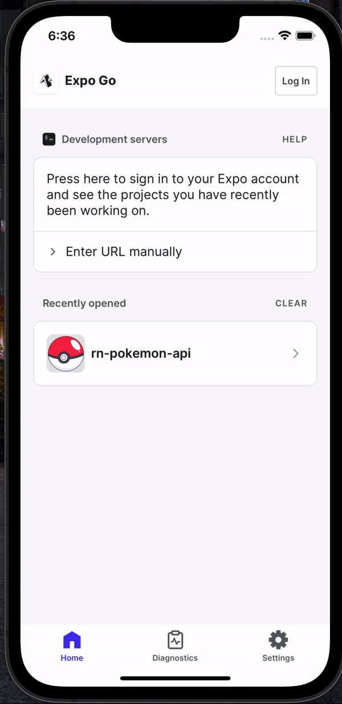
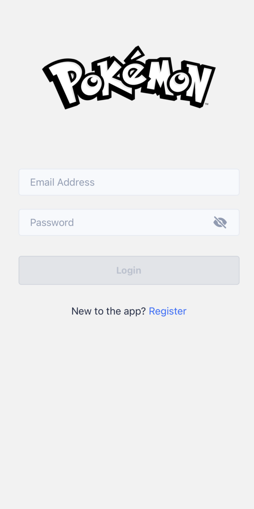
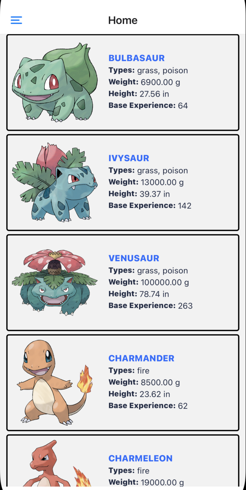

# rn-pokemon-api

React Native for Pokemon API

## Project Setup

## client

This folder contains our React Native Project.

Install required depedencies for this project by running the following command.

```
cd <Project_Root_Folder>/client

yarn install
```

Use the same Node engine and package manager we are using. To do that we create two new files:

- .nvmrc - Will tell other users of the project which version of Node is used

- .npmrc - Will tell other users of the project which package manager is used

As of this writing the node version we are using is Node `v18 Hydrogen` and `yarn`

Note that the use of `engine-strict` didn't specifically say anything about `yarn`, we do that in `package.json` by adding:

```
"engines": {
    "node": ">=18.0.0",
    "yarn": ">=1.22.19",
    "npm": "PLEASE USE YAAAARN! YAAARN YAN?"
}
```

### Run the App

Once you've installed the project and system dependencies, run the following commands to test the app.

```
yarn start
```

This react native project was initialized using `Expo`.

## server

This folder contains our mock/prototype backend to handle authentication requests. All you need to do is have a JSON file as sample data in your root folder. For this project we use `db.json` to mock our storage in handling `users`.

Install required depedencies for this project by running the following command.

```
cd <Project_Root_Folder>/server

yarn install or npm install
```

For our server environment we were more lenient with what package manager to use and node version.

### Run the Server

Once you've installed the project and system dependencies, run the following commands to start the server.

```
npm run mock-db
```

## :bangbang: Take Note

Make sure to start your `server` to allow login and register of users in our mobile app.

## Demo



• Login Screen


• Home Screen

